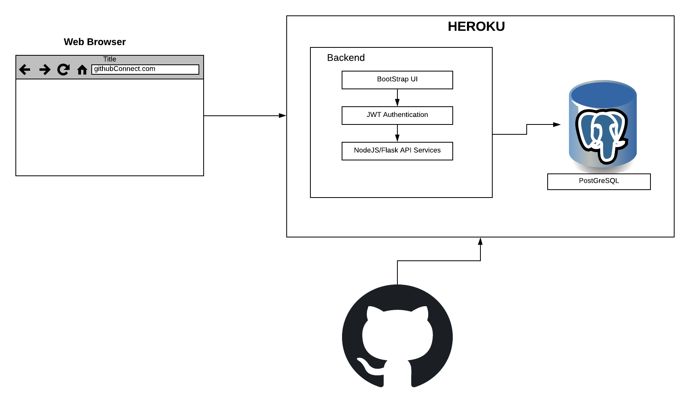
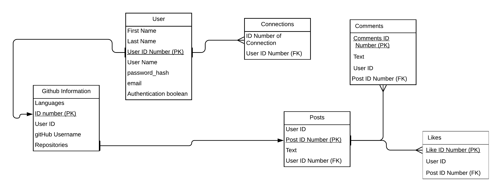

# **GitHub Connector**

## Team Members
#### Adam Conrad
#### Jacob Rashoff
#### Jaskaran Kahlon
#### Jillian Crowley
#### Richard Joseph

URL: https://github-connector-361.herokuapp.com/

GitHub Connector is a social media application that allows people with similar experience to connect with each other, people who use similar tech stacksare suggested as connections to each other. It allows users to:

  - Create a GitHub Connector User Acccount
  - Attach a valid GitHub account
  - Once a GitHub account is linked, a profile will be built and suggestions for connections will be made based on the tech stack the user is using.
    - Connections can be accepted or rejected
  - Sign in and out of the application and ability to delete your profile.
  
  ## **Software Architecture and Design**
GitHub Connector is built with a PostgreSQL, Jinja2 templating, Python/Flask, and Bootstrap stack. Jinja1 is the structural framework and Flask was used for the backend. 

The app will use OAuth authentication. This is a token based technology that allows for users to only access their data and prevents users from accessing other peoples data. 

The backend works with different calls to make requests to the Postgres database, as well as making requests out to the GitHub API. 

The backend allows for different calls to make requests to the database as well as the GitHub API. This will be hosted on Heroku. This will be a three-tiered architecture shown below.

  ## **Database Schema**

  

